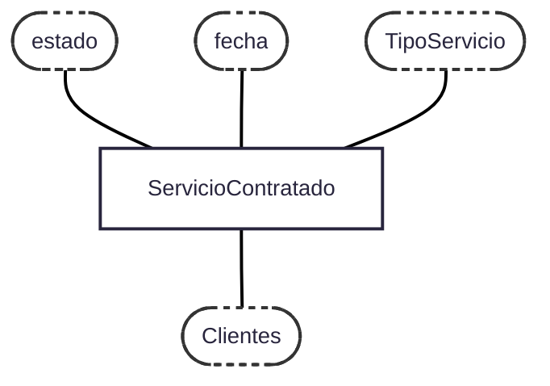
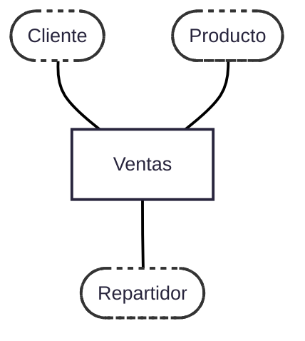

# PREGUNTAS DE EXAMEN - BDD

## MODELO 1

**1. Dado el siguiente caso de estudio: En una empresa de servicios de limpieza en alutra se tiene informacion acerca de los tipos de servicios brindados y de los clientes. Tambien se almacenan servicios que tiene contratado cada cliente con la empresa y la frecuencia de ejecucion de cada servicio.**
- Definir tablas y atributos
- Definir la estructura en una base de datos relacional
- Que indices utilizaria. justificar.
- Definir la estructura en una base de datos no relacional. 
- Definir dimensiones y hechos para armar un DataWarehousing

Clientes: razon_social PK, cuit, direccion, telefono, email

TiposServicios: nombre_servicio PK, descripcion, costo

ClientesServicios: razon_social PK FK, nombre_servicio PK FK, frecuencia_ejecucion, fecha, estado

```sql
    CREATE TABLE Clientes (
        razon_social VARCHAR(50) PRIMARY KEY,
        cuit VARCHAR(20) NOT NULL UNIQUE,
        telefono INT,
        email VARCHAR(50)
    );

    CREATE TABLE TiposServicios (
        nombre VARCHAR(50) PRIMARY KEY,
        descripcion VARCHAR(100) NOT NULL,
        costo DECIMAL(10,2) NOT NULL
    );

    CREATE TABLE ClientesServicios (
        razon_social_cliente VARCHAR(50) NOT NULL,
        nombre_servicio VARCHAR(50) NOT NULL ,
        frecuencia_ejecucion VARCHAR(20) NOT NULL,
        fecha TIMESTAMP NOT NULL,
        estado VARCHAR(10) NOT NULL CHECK(estado IN('en proceso', 'finalizado')),

        PRIMARY KEY (razon_social_cliente, nombre_servicio),
        FOREIGN KEY (razon_social_cliente) REFERENCES Clientes(razon_social),
        FOREIGN KEY (nombre_servicio) REFERENCES TiposServicios(nombre)
    );
```

Utlizaria los siguientes indices de tipo B+ Tree:
-  Para la tabla Clientes utilizaria un indice para cuit y para razon social dado que es frecuente buscar clientes por dichos identificadores para facturar o consultarn rapidamente.
- Para la tabla TiposServicios utilizaria un indice en nombr para acceder rapidamente a los servicios disponibles en la empresa.
- Para la tabla ClientesServicios utilizaria un indice en razon_social_cliente para acceder rapidamente a todos los servicios contratados por un determinado cliente, y un indice para nombre_servicio dado que se va a necesitar acceder tambien a todos los clientes que contrataron un determinado servicio.

Para estructurar la base NoSQL, creo un unico documento de clientes, y por cada agregado, tenemos un atributo ServiciosContratados, el cual sera un arreglo con los servicios que contrato el cliente junto a sus frecuencias de ejecucion.


```javascript
db.createCollection("Clientes");
```

Vamos a definir como HECHO principal a ServicioContratado cuya medida sera monto_facturado y a las dimensiones como Cliente, TipoServicio, fecha, estado.



**2. Dar un ejemplo de un atributo o un conjunto de atributos que sea PK y FK a la vez.**          

Supongamos la entidad empleado y su especializacion gerente. DNI es la PK de empleado por lo que gerente la va a heredar como PK que su vez sera tambien su FK que referencia a Empleado.

**3. Explicar el concepto de recuperacion de base de datos de forma resumida.**      

La recuperacion de base de datos es el proceso mediante el cual una base de datos vuelve a un estado consistente despues de cualquier tipo de falla. Se basa principalmente en:
- Logs(registros de transacciones): Guardan cada cambio antes de aplicarse (WAL)
- Transacciones: Se aseguran que cada operacion sea atomica.
- Mecanismos UNDO y REDO: Se deshacen transacciones que no se completaron al momento de la falla y se rehacen transacciones que ya estaban commiteadas pero sus cambios no llegaron a escribirse en el disco.
- Checkpoints: Puntos de guardado que facilitan la recuperacion rapida.

**4. Explicar brevemente los conceptos de consistencia y disponibilidad en bases de datos distribuidas.**

La consistencia es la propiedad de que, despues de cualquier operacion, todos los nodos del sistema vean el mismo dato actualizado al mismo tiempo.

La disponibilidad es la garantia de que cada solicitud realizada a un nodo que no ha fallado recibe una respuesta, sin importar el estado de otros nodos.

Como el sistema en la practica debe ser tolearante a fallas, se busca una solucion de compromiso entre consistencia y disponibilidad.

## MODELO 2

1. **Dado el siguiente caso de estudio: Una plataforma de comercio electrónico vende productos (físicos o digitales) a clientes. Se registran las ventas realizadas, el detalle de los ítems de cada pedido y los métodos de pago utilizados. Se necesita almacenar también la información de los repartidores/logística para los productos físicos.**
- Definir tablas y atributos
- Definir la estructura en una base de datos relacional
- Que indices utilizaria. justificar.
- Definir la estructura en una base de datos no relacional. 
- Definir dimensiones y hechos para armar un DataWarehousing

Clientes: dni_cliente PK, nombre, telefono, email

Productos: codigo_producto PK, nombre, descripcion, tipo, precio 

Ventas: codigo_venta PK, dni_cliente FK, dni_repartidor FK, monto, fecha, metodo_pago

ItemsVenta: codigo_venta PK FK, codigo_producto PK FK, cantidad     

Repartidores: dni_repartidor PK, salario, fecha_ingreso

```sql
    CREATE TABLE Clientes (
        dni_cliente CHAR(8) PRIMARY KEY,
        nombre VARCHAR(50),
        telefono INT,
        email VARCHAR(50)
    );

    CREATE TABLE Productos (
        codigo_producto VARCHAR(10) PRIMARY KEY,
        nombre VARCHAR(50),
        descripcion VARCHAR(100),
        tipo VARCHAR(10) NOT NULL CHECK (tipo in ('fisico', 'digital')),
        precio DECIMAL(10,2)
    );


    CREATE TABLE Repartidores (
        dni_repartidor CHAR(8) PRIMARY KEY,
        nombre VARCHAR(50) NOT NULL,
        salario DECIMAL(10,2) NOT NULL,
        fecha_ingreso DATE NOT NULL
    );

    CREATE TABLE Ventas (
        codigo_venta VARCHAR(10) PRIMARY KEY,
        dni_cliente CHAR(8) NOT NULL,
        dni_repartidor CHAR(8) NOT NULL,
        fecha DATE NOT NULL,
        monto DECIMAL(10,2) NOT NULL,
        metodo_pago VARCHAR(20) NOT NULL,

        FOREIGN KEY (dni_cliente) REFERENCES Clientes(dni_cliente),
        FOREIGN KEY (dni_repartidor) REFERENCES Repartidores(dni_repartidor)
    );

    CREATE TABLE ItemsVenta (
        codigo_venta VARCHAR(10) NOT NULL,
        codigo_producto VARCHAR(10) NOT NULL,
        cantidad INT,

        PRIMARY KEY (codigo_venta, codigo_producto),
        FOREIGN KEY (codigo_venta) REFERENCES Ventas(codigo_venta),
        FOREIGN KEY (codigo_producto) REFERENCES Productos(codigo_producto)
    );
```

Vamos a utilizar los siguientes indices de tipo B+ Trees:
- Para ventas: 
    - un indice en dni_cliente para obtener las ventas que realizo determinado cliente
    - un indice en fecha para obtener las ventas de una fecha determinada

Para estructurar la base NoSQL, vamos a crear un unico documento Pedidos el cual cada agregado tendra los atributos codigo_venta, dni_cliente, dni_repartidor, monto, metodo_pago y un array items que contendra el codigo de cada producto con su respectiva cantidad y precio.

```javascript
db.createCollecion("Pedidos");
```

Vamos a definir como HECHO a Ventas cuyas medidas seran monto y cantidad_productos, y a las dimensiones como cliente, producto y repartidor



2. ***Describa la función del Grafo de Precedencias en el control de concurrencia.***
    - Defina qué representa un Nodo y qué representa una Arista en este grafo.
    - Explique cómo se utiliza el grafo para determinar si una historia de ejecución concurrente es Serializable.

El grafo de precedencias permite evaluar la serializabilidad por conflictos. Cada nodo representa una transaccion ti. Se agrega una arista entre ti y tj si existe un conflicto: W-R, R-W, o W-W. Cada arista representa una precedencia entre ti y tj. Para que el resultado sea equivalente por conflictos a una ejecucion serial, ti debe preceder a tj. Un orden de ejecucion es SERIALIZABLE por conflictos si su grafo de precedencias no tiene ciclos.

3. ***Explique qué son las Heurísticas de Optimización en el contexto del Optimizador de Consultas.***
    - Mencione la heurística más importante para la cláusula WHERE (Selección) y explique su efecto   sobre la eficiencia del plan de ejecución (costo).
    - Mencione la heurística más importante para la cláusula JOIN (Productos Cartesianos) y justifique por qué se aplica.


Las heuristicas de optimizacion son maneras de ejecutar las consultas de manera que minimicemos el costo de acceder a disco. 

Para la clausula WHERE hay que seleccionar lo antes posible (lo más abajo posible en el árbol de consultas) para obtener la menor cantidad de tuplas para luego usar eso en futuras operaciones de manera de reducir el costo futuro. Para JOIN debemos evitar productos cartesianos cuando sea posible y cambiar productos cartesianos con selecciones, por juntas.

4. ***El Teorema CAP define un compromiso entre Consistencia, Disponibilidad y Tolerancia a Particiones.***
    - Describa el concepto de Tolerancia a Particiones (P) y por qué es un requisito no negociable en un sistema distribuido.
    - Defina la Consistencia Eventual (Eventual Consistency) y explique en qué situación se prefiere este modelo de consistencia (CP o AP) según el Teorema CAP.

La tolerancia a particiones es la cualidad de un sistema para responder una consulta aun cuando algunas conexiones entre algunos pares de nodos esten caidas. En la práctica, dado que no se pueden evitar las fallas de red, un sistema distribuido debe priorizar la Tolerancia a Particiones para seguir funcionando. 

La consistencia eventual ocurre cuando se dejan de producir actualizaciones en los nodos, por lo que eventualmente todos los nodos replica alcanzaran el mismo estado. En el modelo AP, la Consistencia Eventual es el compromiso necesario que permite al sistema mantener la Disponibilidad a expensas de la Consistencia inmediata durante una falla de red.